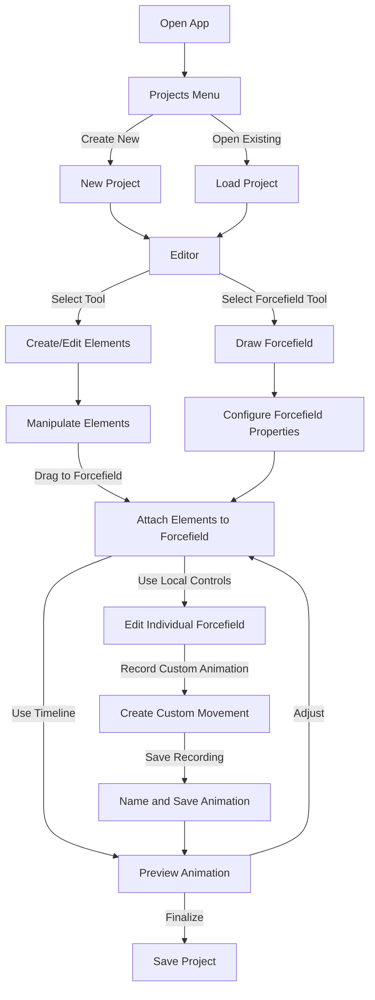

# User Flow Documentation

## Core User Journey

### 1. Project Selection
- User opens the app
- Sees projects menu
- Either creates a new project or opens an existing one

### 2. Editor Introduction
- User enters the editor workspace
- Canvas is centered with tools available in the top bar (mobile) or side panels (desktop)
- Dark theme with rounded UI elements creates a professional environment

### 3. Basic Element Creation
- User selects standard tools to create shapes, text, or import images
- Manipulates these elements using familiar design tool interactions

### 4. Forcefield Creation
- User selects the forcefield tool from the elements panel
- Draws a path on the canvas
- The forcefield appears as a transparent, animated "river/wind" visual that indicates direction and flow
- This visual feedback helps users intuitively understand it's an animation path

### 5. Element Animation
- User drags existing elements onto the forcefield
- Elements "snap" to the forcefield path
- **Important: Elements remain stationary on the forcefield by default**
- **Elements only move when animation is played (either through local forcefield controls or global timeline)**
- This gives users precise control over when animations occur

### 6. Animation Control
- User can control the animation using:
  - Global timeline slider with playback controls:
    - Dragging the slider visualizes the animation at that point in time
    - Play/pause button plays the entire animation continuously
    - Record pinned button allows recording all forcefield animations simultaneously
  - Individual forcefield controls in the design panel:
    - Direction toggle to reverse the flow direction
    - Speed dial to adjust the animation speed
    - Local slider to preview just that forcefield's animation
    - Record button to capture custom slider movements
  - Recording custom animations by manipulating sliders:
    - User presses record button
    - Manipulates the slider back and forth to create the desired movement pattern
    - Stops recording
    - Names and saves the recording
    - Recording appears in the animation selection list for that forcefield

### 7. Working with Multiple Forcefields
- User can create multiple forcefields on the same or different layers
- Elements can be attached to a single forcefield at a time
- When global playback is used:
  - All forcefields animate simultaneously
  - Each forcefield affects only its child elements
  - The global record button saves the animation of each forcefield separately
- When recording individual forcefields:
  - Only the selected forcefield is affected
  - Other forcefields remain static or can be controlled separately
- User can coordinate multiple forcefields to create complex animations

### 8. Input Binding
- On mobile devices:
  - User can use touch sliders for basic control
  - Can enable device pitch/yaw sensors to control animation by physically tilting the device
  - Can combine two sliders to create a virtual joystick for 2D control
- On desktop:
  - User can bind keyboard keys to specific animation directions
  - Can use keyboard for precise control while recording
  - Mouse input can be used for slider manipulation

### 9. Preview & Iteration
- User plays back the animation to see the full effect
- Makes adjustments to timing, path, or element properties
- Continues to refine the animation by:
  - Modifying forcefield paths
  - Adjusting speed and direction
  - Re-recording custom animations
  - Adding or removing elements from forcefields

### 10. Save Project
- User saves the project locally (in prototype phase)
- All forcefields, elements, and custom animations are preserved